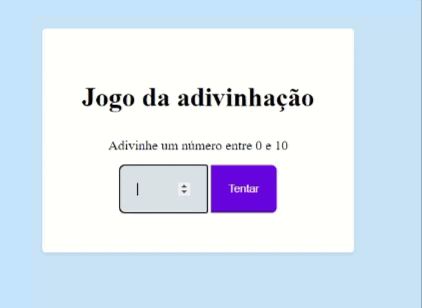

<h1 text="center"></h1>

## Jodo de adivinhação 

Essa aplicação é um jogo de adivinhação. O usuário tenta adivinhar um número aleatório de 1 a 10 e recebe feedback se acertou ou não, com o número de tentativas que fez até acertar. A aplicação também possui um botão de reset para começar o jogo novamente.

## Aborde no decorrer do projeto.

- Manipulação do Dom

- Entendo como aplicar a lógica

- Captura valor do formulário ao click

- Eventos e callbacks

- Refatorização

## Tecnologia Utilizada

- Javascript
- HMTL
- CSS

## Acesse o projeto

 <h3>
        <a href="https://lyrisnunes.github.io/jodo-de-adivinhacao/"> - Veja o projeto clique aqui </a>
</h3>
